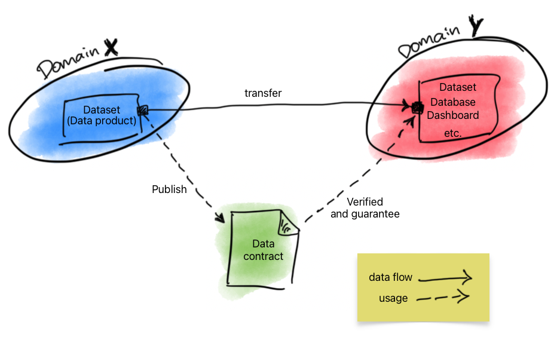
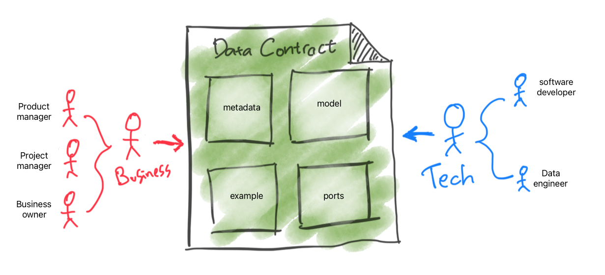
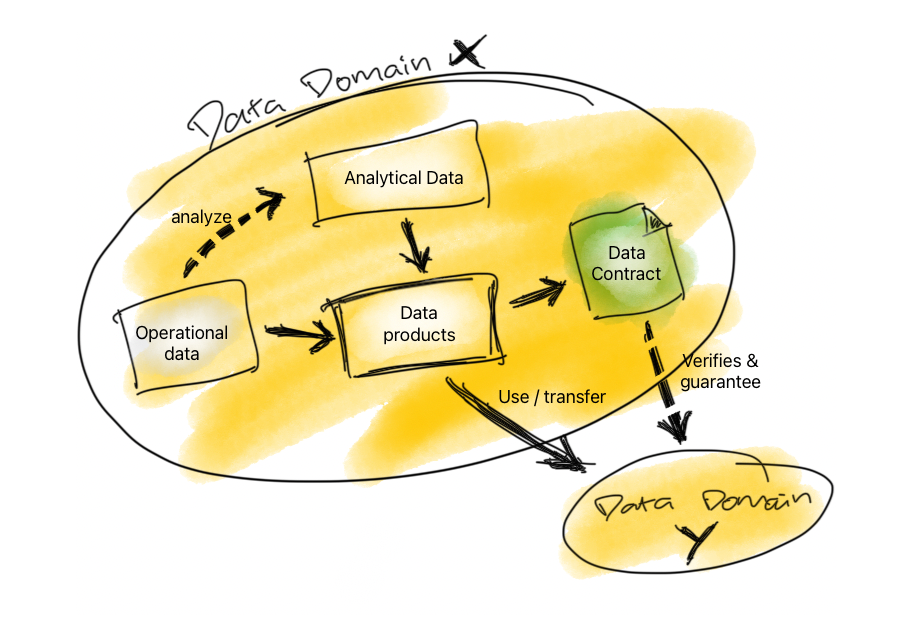

# DataGuard

Selamat datang di halaman resmi DataGuard

## Executive summary

Data Contract memiliki peran krusial dalam meningkatkan interoperabilitas, kualitas data, keamanan, efisiensi, dan integritas data. Sebagai alat yang mendefinisikan struktur dan format data, Data Contract menjadi landasan yang memastikan interpretasi yang benar, konsistensi, dan pengelolaan data yang terstruktur.

## Table of Content

- [Executive Summary](README.md#executive-summary)
- [Table of Content](README.md#table-of-content)
- [Discover the standard](README.md#discover-the-standard)
- [What is Data Contract?](README.md#what-is-data-contract)
  - [Data Contract Demograhics](README.md#data-contract-demograhics)
  - [Benefits](README.md#benefits)
  - [Risks](README.md#risks)
  - [Requirements & Implementation](README.md#requirements--implementation)
  - [Data Contract on Data Product](README.md#data-contract-on-data-product)
- [Contributing to project](README.md#contributing-to-project)
- [About This Project](README.md#about-this-project)
- [Changelog](../CHANGELOG.md)
- [References](README.md#references)

## Discover the standard

Lebih lanjut tentang standar ini dapat ditemukan pada [standar dokumen](docs/readme.md) dan [contoh](examples/readme.md). Proyek ini didukung oleh tim Data Digital Transformation Office Kementerian Kesehatan Republik Indonesia.

## What is Data Contract?

Data contract adalah sebuah dokumen yang mendefinisikan struktur dan format data yang akan dipertukarkan antara dua atau lebih sistem atau aplikasi. Data contract biasanya digunakan untuk mendefinisikan data yang akan dikirimkan melalui API, tetapi juga dapat digunakan untuk mendefinisikan data yang akan dipertukarkan melalui metode lain, seperti file, database atau bahkan _streaming processing_.

Secara keseluruhan, _data contract_ adalah _tools_ yang cukup esensial untuk mengelola dan memanfaatkan data secara efektif didunia yang serba terhubung seperti saat ini. Jika dapat dimanfaatkan dengan benar, _Data Contract_ dapat menjamin efisiensi penggunaan data, kualitas data serta integritas data.

Dibawah ini merupakan ilustrasi singkat yang dapat menggambarkan peranan kunci dari penggunaan _Data Contract_.

Pada ilustrasi diatas, _data contract_ dibuat dan dipublish oleh domain sumber data dan dijadikan sebagai dokumen rujukan oleh domain konsumen data untuk memverifikasi hasil penarikan data.

### Data Contract Demograhics

Pada ilustrasi diatas, menggambarkan bagian-bagian utama dari _Data Contract_ serta pihak-pihak yang kemungkinan besar terlibat sebagai _stakeholders_.
Penjelasan lebih lanjut mengenai bagian-bagian serta fungsinya dapat dilihat pada halaman [standar dokumen](docs/readme.md) dan contohnya dapat ditemukan pada halaman [contoh](examples/data-contract-example.yaml).

### Benefits

Dari ilustrasi tersebut, paling tidak ada beberapa keuntungan ketika menggunakan data contract, antara lain :

- Data contract dapat membantu **memastikan bahwa data yang dikirimkan antara dua sistem atau aplikasi dapat diinterpretasikan dengan benar**. Hal ini penting untuk sistem dan aplikasi yang berasal dari vendor yang berbeda atau yang dikembangkan oleh tim yang berbeda.
- Data contract dapat digunakan untuk mendefinisikan struktur data yang akan dikelola. Hal ini dapat membantu memastikan bahwa **data dikelola secara konsisten dan terstruktur**.
- Data contract dapat digunakan untuk membatasi akses ke data tertentu. Hal ini dapat membantu **melindungi data sensitif dari akses yang tidak sah**.
- Data contract dapat digunakan untuk meningkatkan efisiensi penggunaan data. Data contract dapat membantu memastikan bahwa data yang dikirimkan hanya data yang diperlukan oleh sistem atau aplikasi penerima. Hal ini dapat mengurangi jumlah data yang dikirimkan dan diterima, sehingga dapat meningkatkan efisiensi penggunaan bandwidth dan penyimpanan data.
- Data contract dapat digunakan untuk meningkatkan integritas data. Data contract dapat membantu memastikan bahwa data yang dikirimkan lengkap dan akurat. Hal ini dapat membantu mencegah terjadinya kesalahan data dan memastikan bahwa data yang digunakan oleh sistem atau aplikasi adalah data yang valid.

### Risks

Namun data contract juga mempunyai beberapa resiko seperti dibawah ini :

- Data contract dapat mengandung kesalahan, seperti kesalahan dalam mendefinisikan nama atau tipe data. Hal ini dapat menyebabkan kesalahan dalam sistem dan aplikasi yang menggunakan data contract tersebut.
- Data contract dapat menjadi kompleks, terutama jika mendefinisikan data yang kompleks. Hal ini dapat membuat _data contract_ sulit untuk dikelola dan dipelihara. Itulah sebabnya pada proses penerapannya _data contract_ akan terus membutuhkan ruang untuk berevolusi untuk menjawab kebutuhan bisnis pertukaran data.

### Requirements & Implementation

Secara umum _data contract_ merupakan sebuah dokumen yang diharuskan untuk :

- Mudah untuk dibaca dan dibuat oleh manusia bahkan untuk seseorang yang tidak mempunyai latar belakang teknis seperti _software developer_ atau yang semisal
- Mudah untuk dibaca dan di-_compile_ oleh mesin (_computer_)
- Mempunyai _version control_

### Data Contract on Data Product

Setiap _Data Product_ pasti dan harus mempunyai sebuah _Data Contract_ sebagai _showcase_ dari produk itu sendiri, dengan adanya _Data Contract_ diharapkan dapat memberikan gambaran yang jelas bagi setiap _stakeholders_ sehingga interpretasi dari data (yang sudah menjadi sebuah produk) akan seragam disetiap _stakeholders_ yang terlibat sehingga setiap _stakeholders_ berada didalam "satu page" yang sama.

Untuk informasi lebih lanjut dan bagaimana mendesain sebuah _Data Product_ dapat dipelajari pada halaman berikut -> [Data Product Canvas](https://www.datamesh-architecture.com/data-product-canvas)

