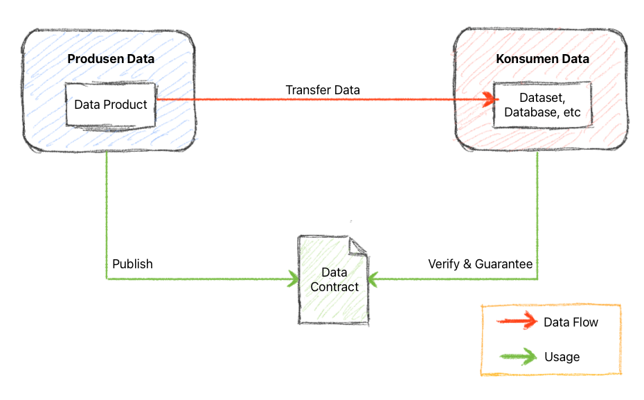
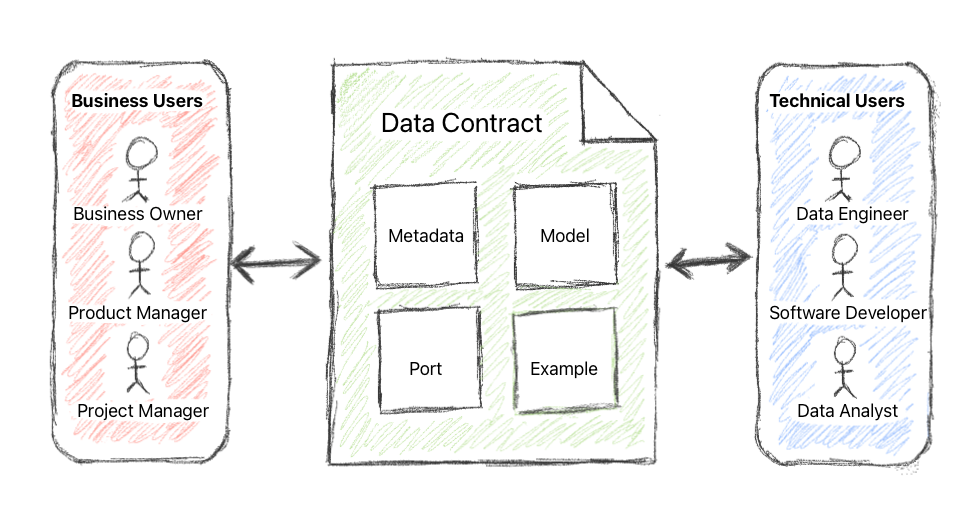
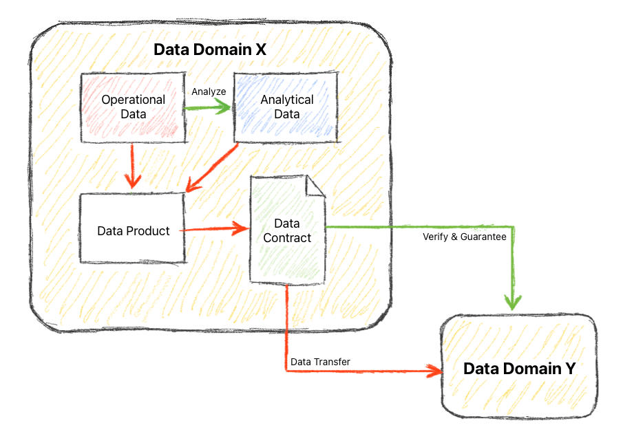

# DataGuard Contract

## Executive Summary

DataGuard Contract memiliki peran krusial dalam meningkatkan interoperabilitas, kualitas data, keamanan, efisiensi, dan integritas data. Sebagai alat yang mendefinisikan struktur dan format data, DataGuard Contract menjadi landasan yang memastikan interpretasi yang benar, konsistensi, dan pengelolaan data yang terstruktur.

## Table of Content

- [Executive Summary](README.md#executive-summary)
- [Table of Content](README.md#table-of-content)
- [Discover the standard](README.md#discover-the-standard)
- [What is DataGuard Contract?](README.md#what-is-dataguard-contract)
  - [DataGuard Contract Demograhics](README.md#dataguard-contract-demograhics)
  - [Benefits](README.md#benefits)
  - [Risks](README.md#risks)
  - [Requirements & Implementation](README.md#requirements--implementation)
  - [DataGuard Contract on Data Product](README.md#dataguard-contract-on-data-product)
- [Contributing to project](../CONTRIBUTING.md)
- [Changelog](../CHANGELOG.md)
- [References](../README.md#references)

## Discover the standard

Lebih lanjut tentang standar ini dapat ditemukan pada halaman [DataGuard Contract](docs/README.md) dan untuk melihat contohnya dapat ditemukan pada halaman [DataGuard Contract Example](examples/README.md). 

## What is DataGuard Contract?

DataGuard Contract adalah sebuah dokumen yang mendefinisikan struktur dan format data yang akan dipertukarkan antara dua atau lebih sistem atau aplikasi. DataGuard Contract biasanya digunakan untuk mendefinisikan data yang akan dikirimkan melalui API, tetapi juga dapat digunakan untuk mendefinisikan data yang akan dipertukarkan melalui metode lain, seperti file, database atau bahkan _streaming processing_.

Secara keseluruhan, _DataGuard Contract_ adalah _tools_ yang cukup esensial untuk mengelola dan memanfaatkan data secara efektif didunia yang serba terhubung seperti saat ini. Jika dapat dimanfaatkan dengan benar, _DataGuard Contract_ dapat menjamin efisiensi penggunaan data, kualitas data serta integritas data.

Dibawah ini merupakan ilustrasi singkat yang dapat menggambarkan peranan kunci dari penggunaan _DataGuard Contract_.

Pada ilustrasi diatas, _DataGuard Contract_ dibuat dan dipublish oleh domain sumber data (Domain X) dan dijadikan sebagai dokumen rujukan oleh domain konsumen  data (Domain Y) untuk memverifikasi hasil penarikan data.

### DataGuard Contract Demograhics

Pada ilustrasi diatas, menggambarkan bagian-bagian utama dari _DataGuard Contract_ serta pihak-pihak yang kemungkinan besar terlibat sebagai _stakeholders_.
Penjelasan lebih lanjut mengenai bagian-bagian serta fungsinya dapat dilihat pada bagian [Discover the standard](README.md#discover-the-standard).

### Benefits

Dari ilustrasi tersebut, paling tidak ada beberapa keuntungan ketika menggunakan DataGuard Contract, antara lain :

- DataGuard Contract dapat membantu **memastikan bahwa data yang dikirimkan antara dua sistem atau aplikasi dapat diinterpretasikan dengan benar**. Hal ini penting untuk sistem dan aplikasi yang berasal dari vendor yang berbeda atau yang dikembangkan oleh tim yang berbeda.
- DataGuard Contract dapat digunakan untuk mendefinisikan struktur data yang akan dikelola. Hal ini dapat membantu memastikan bahwa **data dikelola secara konsisten dan terstruktur**.
- DataGuard Contract dapat digunakan untuk membatasi akses ke data tertentu. Hal ini dapat membantu **melindungi data sensitif dari akses yang tidak sah**.
- DataGuard Contract dapat digunakan untuk meningkatkan efisiensi penggunaan data. DataGuard Contract dapat membantu memastikan bahwa data yang dikirimkan hanya data yang diperlukan oleh sistem atau aplikasi penerima. Hal ini dapat mengurangi jumlah data yang dikirimkan dan diterima, sehingga dapat **meningkatkan efisiensi penggunaan bandwidth dan penyimpanan data**.
- DataGuard Contract dapat digunakan untuk meningkatkan integritas data. DataGuard Contract dapat membantu memastikan bahwa **data yang dikirimkan lengkap dan akurat**. Hal ini dapat membantu mencegah terjadinya kesalahan data dan memastikan bahwa data yang digunakan oleh sistem atau aplikasi adalah data yang valid.

### Risks

Namun DataGuard Contract juga mempunyai beberapa resiko seperti dibawah ini :

- DataGuard Contract dapat mengandung kesalahan, seperti _human error_ dalam mendefinisikan nama atau tipe data. Hal ini dapat menyebabkan kesalahan pada sistem atau aplikasi yang menggunakan DataGuard Contract tersebut.
- DataGuard Contract dapat menjadi kompleks, terutama jika mendefinisikan data yang kompleks. Hal ini dapat membuat _DataGuard Contract_ sulit untuk dikelola dan dipelihara. Itulah sebabnya pada proses penerapannya _DataGuard Contract_ akan terus membutuhkan ruang untuk berevolusi untuk menjawab kebutuhan bisnis pertukaran data.

### Requirements & Implementation

Secara umum _DataGuard Contract_ merupakan sebuah dokumen yang diharuskan untuk :

- Mudah untuk dibaca dan dibuat oleh manusia bahkan untuk seseorang yang tidak mempunyai latar belakang teknis seperti _software developer_ atau yang semisal
- Mudah untuk dibaca dan di-_compile_ oleh mesin (_computer_)
- Mempunyai _version control_

### DataGuard Contract on Data Product

Dalam konteks sebuah _Data Product_, diperlukan sebuah dokumen yang dapat memberikan gambaran yang jelas bagi setiap _stakeholders_ agar dapat menginterpretasikan sebuah data dengan benar. Hal ini bertujuan agar setiap _stakeholders_ terkait berada pada satu sudut pandang yang sama.

Disinilah peran DataGuard Contract sangat dibutuhkan pada sebuah _Data Product_.

Untuk informasi lebih lanjut dan bagaimana mendesain sebuah _Data Product_ dapat dipelajari pada halaman berikut -> [Data Product Canvas](https://www.datamesh-architecture.com/data-product-canvas)

