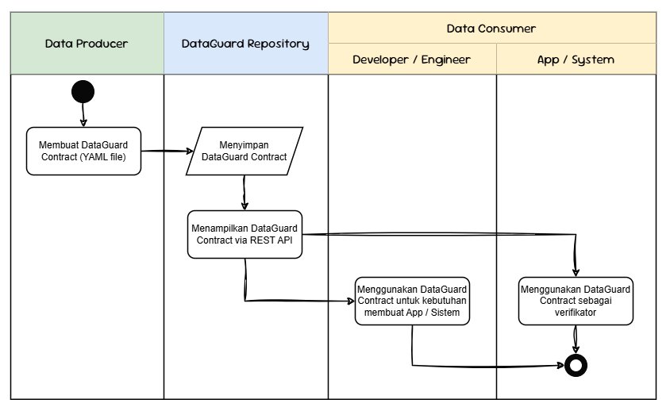
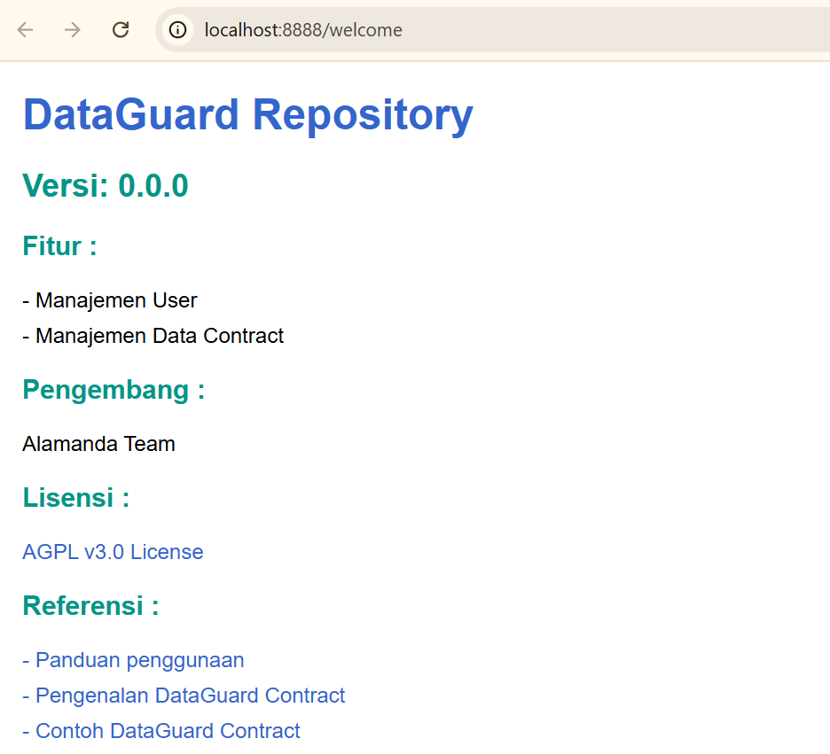
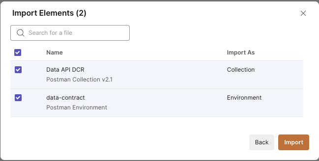

# DataGuard Repository (DGR)

## How it Works

Dokumentasi dari penggunaan DataGuard Repository dapat dilihat pada [dokumentasi](file/docs/readme.md) berikut.

## Prerequisites
1. Sudah terinstall [Docker](https://docs.docker.com/engine/install/)
2. Sudah terinstall `make` command
3. Sudah membaca [DataGuard Contract Standard](../dataguard-contract/README.md)

## Run the environment
1. Buka aplikasi terminal atau command prompt
2. Pastikan anda berada pada directory `dataguard-repository/`
3. Jalankan perintah `make copy_env_file`
4. Jalankan perintah `make service_start` untuk menjalankan service DataGuard Repository
5. Akses link http://localhost:8888 pada browser anda

    > Note: Service DataGuard Repository sudah berhasil berjalan yang ditandai dengan tampil halaman web seperti gambar diatas.
6. (Optional) jalankan perintah `make service_stop` untuk menghentikan service DataGuard Repository

## Prepare the Postman Collection
1. Download file [collection](file/postman_collection/data-contract.postman_collection.json) dan [environment](file/postman_collection/data-contract.postman_environment.json) berikut
2. Buka aplikasi Postman pada workstation anda
3. Pada pojok kanan atas, klik tombol `Import`
4. Drag and drop kedua file json yang telah didownload (langkah no. 1) ke dalam kotak yang telah disediakan, kemudian klik tombol `Import` 

5. Pada menu collection anda akan mendapati sebuah collection baru terbentuk dengan nama "DataGuard Repository APIs"

## Changelog
Dapat dibaca pada halaman [Changelog](../CHANGELOG.md).

## References
- https://learning.postman.com/docs/getting-started/importing-and-exporting/importing-data/
- https://leangaurav.medium.com/how-to-setup-install-gnu-make-on-windows-324480f1da69