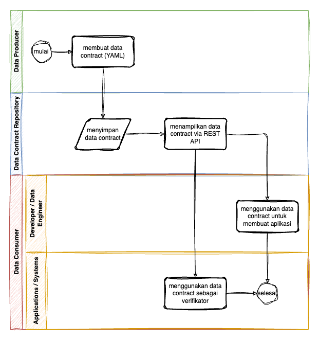
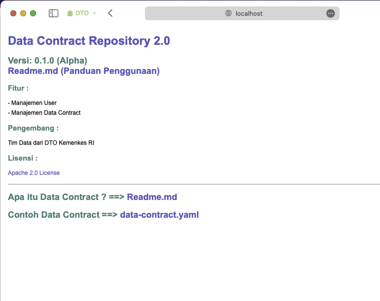
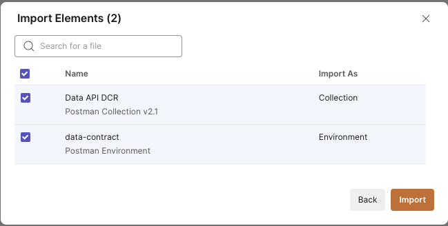
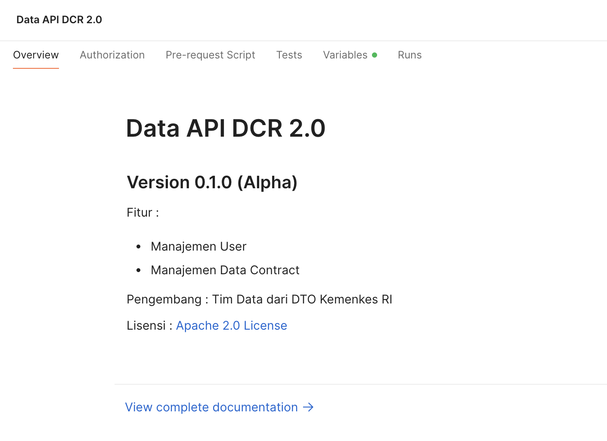

# Data Contract Repository (DCR)

## How it Works

Dokumentasi dari penggunaan Data Contract Repository dapat dilihat pada [dokumentasi](file/docs/readme.md) berikut.

## Prerequisites
1. Workstation sudah terinstall [Docker](https://docs.docker.com/engine/install/)
2. Sudah membaca -> [Data Contract Standard](../data-contract/README.md)
3. Sudah terinstall `make` command

## Run the environment
1. Pastikan anda berada di root folder
2. Jalankan perintah `make copy_env_file`
3. Jalankan perintah `make service_start` untuk menjalankan service DCR
4. Akses link http://localhost:8888 pada browser anda

    > Note: Service DCR 2.0 sudah berhasil dijalankan jika tampil halaman web seperti gambar diatas.
5. (Optional) jalankan perintah `make service_stop` untuk menghentikan service DCR 2.0

## Prepare the Postman Collection
ref : https://learning.postman.com/docs/getting-started/importing-and-exporting/importing-data/
1. Download ke-dua file [collection](file/postman_collection/data-contract.postman_collection.json) dan [environment](file/postman_collection/data-contract.postman_environment.json) berikut.
2. Buka aplikasi Postman pada workstation anda.
3. Pada pojok kanan atas, klik "Import".
4. Geret kedua file json yang telah anda download pada langkah no.1 kedalam kotak yang telah disediakan, kemudian pilih "Import". Kurang lebih tampilannya akan seperti dibawah ini.

5. Pada menu collection anda akan mendapati sebuah collection baru terbentuk dengan nama "Data API DCR 2.0".

## Changelog
Dapat dibaca pada -> [changelog.md](../CHANGELOG.md)